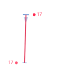
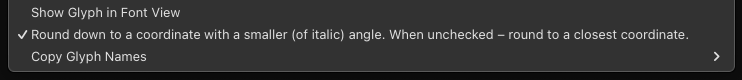

# Highlight Imprecise Italic Angle

A plugin for the [Glyphs font editor](http://glyphsapp.com/) that highlights the path segments which angle is not precise (or not closest) to Italic Angle of the selected master and is within observed angle range (±10 degrees around Italic Angle). Also it adds placeholder dots around the nodes to indicate the horizontal direction and position for better node placement where segment's angle will be precise (or closest) to Italic Angle. Besides checking the standard Italic Angle, you can set an additional Italic Angles to check, which will be highlighted in different (of red) colors.

# Italic Angles

Standard Italic Angle is set in Font Info > Masters > Italic Angle. Additional Italic Angles are set in Font Info > Masters > Number Values. You can add as many angles to check as you need. The name of each additional angle should contain "Italic Angle", like for example "Italic Angle for x-height (cyan highlight color)".

# Colors

If you need to check only one standard Italic Angle, it will be highlighted with red. However, the tool has 5 different colors (green, yellow, red, purple, cyan) for 5 different Italic Angles to check. If you specify more than 5 angles (like standard one + 4 custom ones), the extra colors will be repeated cyclically. Standard Italic Angle is always highlighted in red. The two greater (than Italic) angles are highlighted in purple and cyan. The two smaller (than Italic) angles are highlighted in yellow and green.

# Rounding options

If the precise italic angle lies between two integer coordinates, here are two options of rounding (to .x coordinate with a greater or smaller angle) that could be toggled by right click context menu item called "Round down to a coordinate with a smaller (of italic) angle. When unchecked – round to a closest coordinate.".

- When checked (by default), it always will round down to a coordinate with a smaller angle. This rounding down option was added by [request of Tim Ahrens](https://forum.glyphsapp.com/t/highlight-imprecise-italic-angle-reporter-plugin/33688/5).
- When unchecked, it will round the angle to the closest coordinate. If you are working with an angle like just 11° or 12° which is not based on integer ratios, there will be a lot of “almost precise” angle coordinates where you may prefer for example to round up to +0.02° instead of round down to -0.98°.

# Distance

The distance from a node to the placeholder dot is displayed in number next to the placeholder dot, so it is easier to know how much the node should be moved to fit the correct position. For example, if you see the number 4, you need to press the left or right arrow key 4 times. It makes the correction faster.

# Background

The issue of path correction after interpolation is always relevant, especially for italic styles. Usually the glyph shape has its own differences in different masters, so after interpolation (and more often after extrapolation) there are possible kinks, broken rounded nodes, and deviations from the Italic Angle. Read more about the issue in topic [Is there a quick way to fix paths after interpolation?](https://forum.glyphsapp.com/t/is-there-a-quick-way-to-fix-paths-after-interpolation/3311). Usually, RMX Tools is used to correct such errors. On the other hand, *Highlight Imprecise Italic Angle* is more designed for manual review of each glyph, because sometimes it should be estimated by eye and the correction is not always needed.
