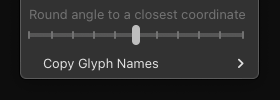

# Highlight Imprecise Italic Angle

A plugin for the [Glyphs font editor](http://glyphsapp.com/) that highlights the path segments which angle is not precise (or not closest) to Italic Angle of the selected master and is within observed angle range (±10 degrees around Italic Angle). Also it adds placeholder dots around the nodes to indicate the horizontal direction and position for better node placement where segment's angle will be precise (or closest) to Italic Angle. Besides checking the standard Italic Angle, you can set an additional Italic Angles to check, which will be highlighted in different (of red) colors.

# Italic Angle

Standard Italic Angle is set in Font Info > Masters > Metrics > Italic Angle.

# Check multiple angles

Additional angles are set in Font Info > Masters > Number Values. The name of each additional angle should contain "Italic Angle", such as "Italic Angle for x-height". You can add as many angles to check as you need.

# Colors

The tool has 5 predefined colors (green, yellow, red, purple, cyan) for 5 different angles to check (like standard Italic Angle + 4 custom ones). Standard Italic Angle is always highlighted in red. The two greater (than Italic) angles are highlighted in purple and cyan. The two smaller (than Italic) angles are highlighted in yellow and green.

# Rounding

If the precise Italic Angle lies between two integer coordinates, it will be rounded to one of these integer coordinate. By default it is a closest coordinate, but you can change this rounding tolerance using a slider in right click contextual menu. Rounding down option initially was added by [request of Tim Ahrens](https://forum.glyphsapp.com/t/highlight-imprecise-italic-angle-reporter-plugin/33688/5).

- Leftmost position (0) – always round down to a coordinate with a smaller angle.
- From leftmost to middle position (0.1–0.4) – prefer round down to a coordinate with a smaller angle. The closer to left side means more rounding down cases.
- Middle position (0.5, default) – round the angle to a closest coordinate.
- From middle to rightmost position (0.6–0.9) – prefer round up to a coordinate with a greater angle. The closer to right side means more rounding up cases.
- Rightmost position (1) – always round up to a coordinate with a greater angle.

# Distance

The distance from a node to the placeholder dot is displayed in number next to the placeholder dot, so it is easier to know how much the node should be moved to fit the correct position. For example, if you see the number 4, you need to press the left or right arrow key 4 times. It makes the correction faster.

# Background

The issue of path correction after interpolation is always relevant, especially for italic styles. Usually the glyph shape has its own differences in different masters, so after interpolation (and more often after extrapolation) there are possible kinks, broken rounded nodes, and deviations from the Italic Angle. Read more about the issue in topic [Is there a quick way to fix paths after interpolation?](https://forum.glyphsapp.com/t/is-there-a-quick-way-to-fix-paths-after-interpolation/3311). Usually, RMX Tools is used to correct such errors. On the other hand, *Highlight Imprecise Italic Angle* is more designed for manual review of each glyph, because sometimes it should be estimated by eye and the correction is not always needed.
